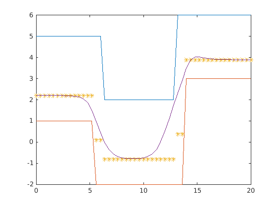
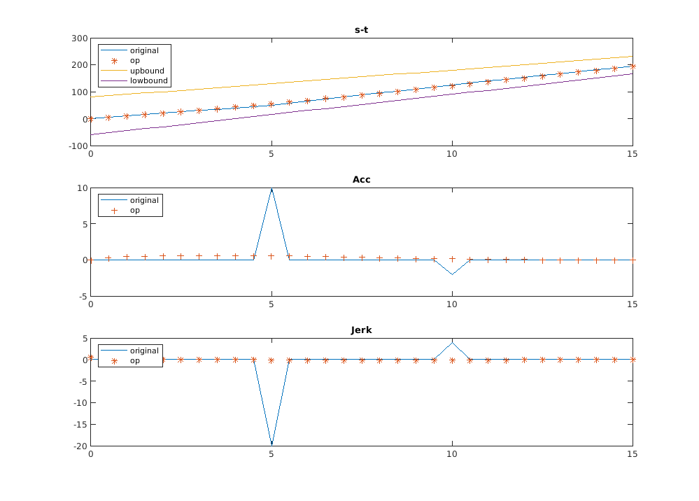
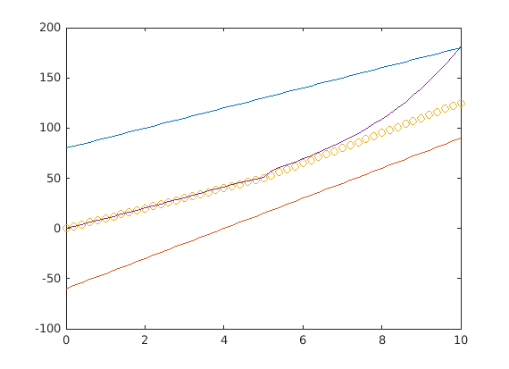

# piecewise_jerk_path_optimizer
Pure C piecewise jerk path optimizer of Apollo for S-L Planning

*Note* This project heavily depends on the following open-source repos:

[qpSwift](https://github.com/qpSWIFT/qpSWIFT) Light-weight sparse Quadratic Programming Solver

[sparse_matrix_conversion](https://github.com/kmpape/sparse_matrix_conversion) Utilities to convert dense matrix formats to sparse matrix formats and the reverse.

## Results

+ Matlab quadprog path problem



+ Matlab quadprog speed problem

  

### About *options* setting

[Matlab Quadprog](https://ww2.mathworks.cn/help/optim/ug/quadprog.html?lang=en)

when changing weighting parameters  with the option setting as follows :

```matlab
w1 = 0.5; % error with DP ST results
w2 = 1; % acc
w3 = 1e2; %  jerk

options = optimoptions('quadprog','Display','iter','TolFun',1e-16,'TolCon',1e-16);
[C_new,fval,exitflag,output,lambda] = quadprog(H_final,f_final,A_sample,s_front,Aeq,beq,[],[],[],options);
```

we get the output:

```
Solved 3 variables, 3 equality, and 1 inequality constraints during the presolve.

 Iter            Fval  Primal Infeas    Dual Infeas  Complementarity  
    0   -4.172134e+03   1.989214e+01   1.579760e+02     7.898798e+01  
    1   -1.253205e+04   1.607123e+01   1.276317e+02     6.474734e+01  
    2   -2.026427e+04   2.164002e-01   1.718569e+00     8.938420e-01  
    3   -2.026665e+04   1.082001e-04   8.592846e-04     4.471063e-04  
    4   -2.026665e+04   5.410320e-08   4.296423e-07     2.235531e-07  
    5   -2.026665e+04   2.940276e-11   3.143214e-09     1.117766e-10  
    6   -2.026665e+04   6.063483e-13   5.005859e-09     5.588828e-14  
    7   -2.026665e+04   2.980116e-13   4.423782e-09     2.794414e-17  

Minimum found that satisfies the constraints.

Optimization completed because the objective function is non-decreasing in 
feasible directions, to within the value of the optimality tolerance,
and constraints are satisfied to within the value of the constraint tolerance.

<stopping criteria details>

fval =

  -2.2350e+04


exitflag =

     1


output = 

  struct with fields:

            message: '↵Minimum found that satisfies the constraints.↵↵Optimization completed because the objective function is non-decreasing in ↵feasible directions, to within the value of the optimality tolerance,↵and constraints are satisfied to within the value of the constraint tolerance.↵↵<stopping criteria details>↵↵Optimization completed: The relative dual feasibility, 1.830248e-19,↵is less than options.OptimalityTolerance = 1.000000e-16, the complementarity measure,↵2.794414e-17, is less than options.OptimalityTolerance, and the relative maximum constraint↵violation, 1.232961e-23, is less than options.ConstraintTolerance = 1.000000e-16.↵↵'
          algorithm: 'interior-point-convex'
      firstorderopt: 4.4224e-09
    constrviolation: 7.4385e-15
         iterations: 7
       linearsolver: 'dense'
       cgiterations: []
```

With the result:



**The solver parameters and the weighting parameters should be carefully examined before using the code!**

**Grasp the math and design mechanism behind!!!**

## Dev Tasks

- [x] Construct a typical QP demo using the sparse_matrix_conversion Tool for creating sparse matrix.
- [x] Construct a typical Piecewise_Jerk_Path QP problem using Matlab quadprog function.
- [x] Construct a typical Piecewise_Jerk_Speed QP problem using Matlab quadprog function.
- [x] Perform  piecewise_jerk_path_optimizer task in pure c code.
